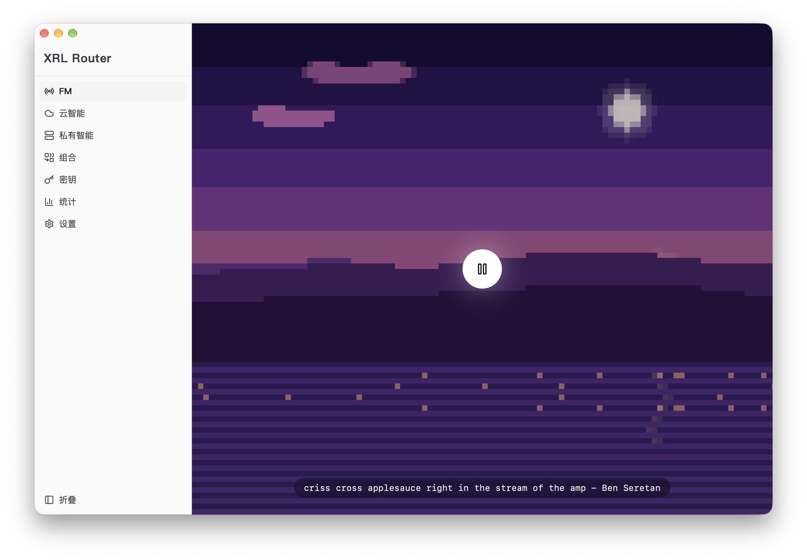
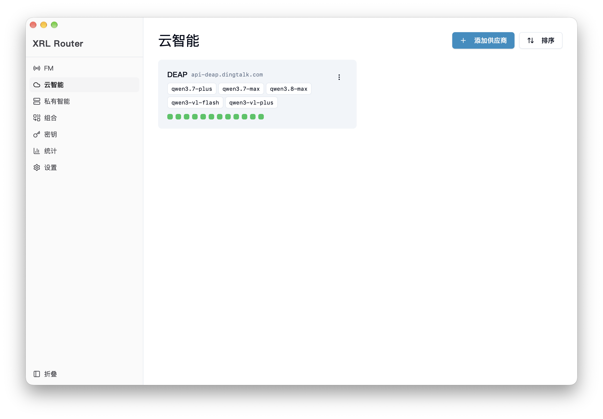
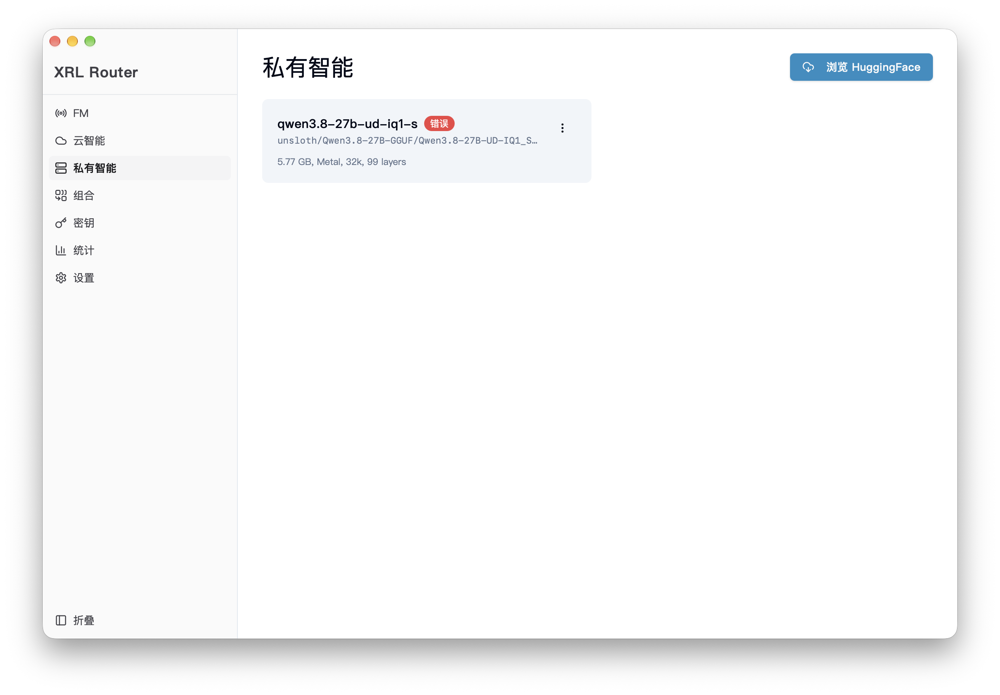
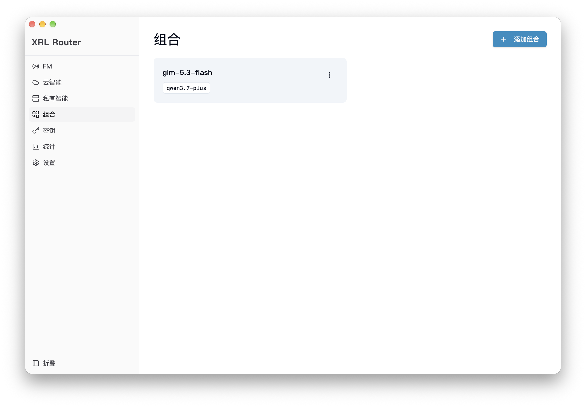
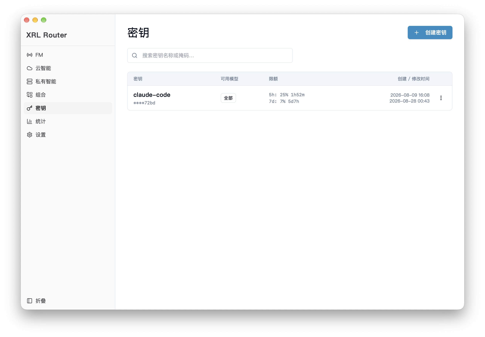
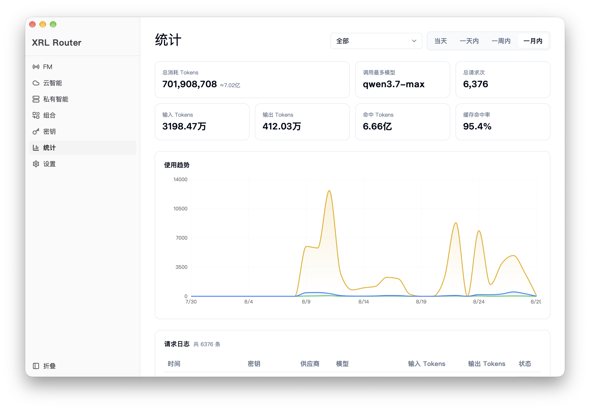

# xrl-router

> 多 Provider AI LLM API 路由网关 — Tauri 2 桌面应用

xrl-router 是一个运行在本地的 LLM API 统一网关。客户端通过 Anthropic Messages、OpenAI Chat Completions 或 OpenAI Responses API 三种端点访问所有大模型 Provider，网关负责路由解析、密钥轮换和用量统计。

## 界面预览

<table>
  <tr>
    <td width="50%">
      
    </td>
    <td width="50%">
      
    </td>
  </tr>
  <tr>
    <td width="50%">
      
    </td>
    <td width="50%">
      
    </td>
  </tr>
  <tr>
    <td width="50%">
      
    </td>
    <td width="50%">
      
    </td>
  </tr>
</table>

## What is this?

- **定位**：本地优先的 LLM API 网关桌面应用
- **核心问题**：LLM 生态协议碎片化（Anthropic/OpenAI 等 API 格式不兼容），开发者需维护多套客户端代码，密钥散落各处

## Why does it exist?

- **统一接入**：通过单一端点访问所有 Provider，客户端零配置
- **本地优先**：数据不经第三方，隐私安全
- **轻量美观**：Tauri 2 框架，安装包 < 10MB，内存占用 < 100MB
- **现有方案不足**：OpenRouter 是云端 SaaS、LiteLLM 是 Python 服务、one-api 需要 Docker 部署，本地开发体验差

## How to install and run?

### 前置要求

- **Rust** >= 1.75.0
- **Node.js** >= 20 + **pnpm**
- Tauri CLI 已包含在 devDependencies 中

### 安装与运行

```bash
# 前端依赖
pnpm install

# 开发模式（前端 :5173 + 后端 :19068）
pnpm dev

# 生产构建（macOS .dmg / Windows .msi）
pnpm build
```

### 接入客户端

- **Base URL**：`http://127.0.0.1:19068`
- **API Key**：在应用内「密钥管理」页创建的 Service Key
- **模型**：使用应用内配置的模型别名（网关负责路由到真实上游）

### 局域网分发

把本机变成局域网 API 网关：在「密钥管理」页创建密钥后，弹窗里复制「分发链接」，发给局域网设备打开。Install 页面支持 Claude Code 和 ChatGPT/Codex 两种消费端，按平台生成单行命令。详见 [docs/specs/module-lan-deploy.md](docs/specs/module-lan-deploy.md)。

## Current status

- **Stage**：stable（核心功能已完成）
- **已知限制**：
  - 不支持 Google Gemini 等新协议（需走插件系统）
  - 单用户本地桌面应用，不支持多租户/云端部署
  - Claude FM 桌面壁纸劫持仅支持 Windows 11 / macOS，且仅主显示器（分辨率/DPI 变化后需重新勾选恢复）

## Core tech

- **后端**：Rust + Tauri 2 + axum 0.7 + tokio
- **数据库**：SQLite 3 (WAL 模式)
- **前端**：React 19 + Zustand + shadcn/ui (Radix UI + Tailwind CSS)
- **协议转换**：IR（中间表示层）统一 Anthropic Messages / OpenAI Chat Completions / OpenAI Responses API 三种格式
- **安全**：AES-256-GCM 加密 Provider Key + Argon2 哈希 Service Key

## 项目文档

```
docs/
├── PRD.md          — 产品需求文档（功能存在的意义）
├── ARCHITECTURE.md — 架构地图（稳定的结构关系）
├── DECISIONS.md    — 架构决策记录（历史原因）
└── specs/          — 代码生成契约（可独立完成的任务单元）
```

## CI

push 到 main 自动构建 macOS arm64 (.dmg) 和 Windows amd64 (.msi) 安装包，发布到 GitHub Releases。

> Note: README 不承载项目的完整文档职责，详细信息见 [docs/](docs/)。
